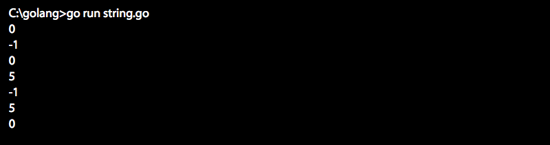
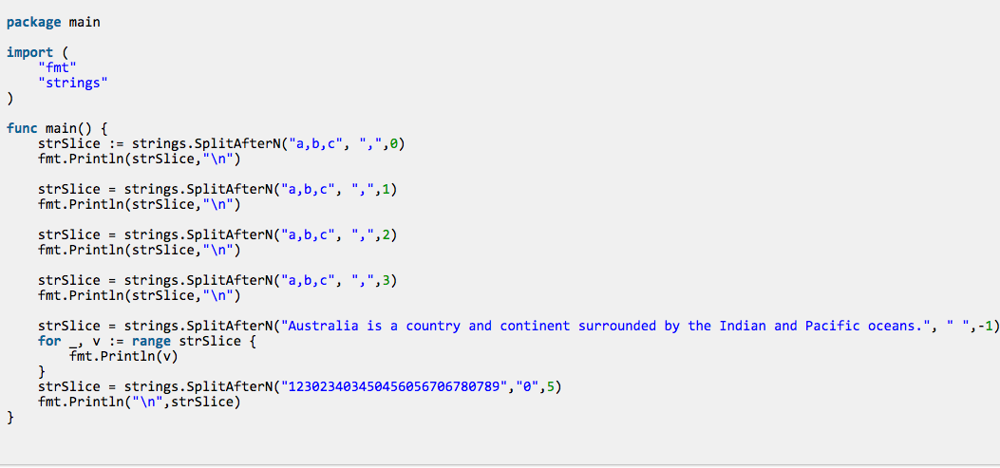
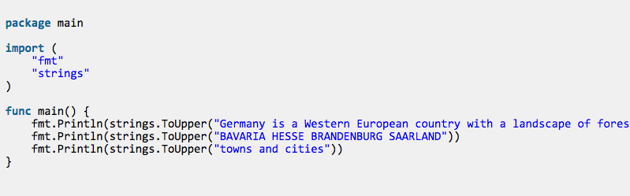

#[译]Golang 最常用的String函数
[Most Popular Golang String Functions](http://www.golangprograms.com/golang/string-functions)

Golang提供了一系列的内建string函数来操作字符串数据。Golang的字符串函数作为Golang核心的一部分，无需安装即可使用。只要`import "strings"`就可以了。下面列举了最常用的几个函数。

## 1. Compare：按照字典顺序比较两个字符串
通过函数`Compare`可以对两个字符串做比较操作，其返回值为小于0、等于0或者大于0.当参数1大于参数2的时候返回值大于0，如果小于则返回小于0，当等于时则等于0。

函数原型：

    func Compare(a, b string) int

示例：

当运行程序时，输出：

## 2。Contain：按照大小写查找是否包含子串
通过函数`Contain`可以查找一段指定的文本、字符串或者字符。其返回值为true或者false。当第一个参数包含第二个参数时返回true，否则返回false。

函数原型：

   func Contains(s, substr string) bool

示例：

运行时输出：

## 3. ContainsAny: 包含其一（大小写敏感）
通过函数`ContainsAny`判断字符串是否包含一段指定文本、字符串或者字符中的一个。其返回true或者false。当包含时返回true，否则返回false。

函数原型：

    func ContainsAny(s, chars string) bool

示例：

运行结果：

## 4. Count: 求取长度
计算字符中除结尾'\0'以外的字符格式，兼容Unicode编码

函数原型：

   
   func Count(s, sep string) int

示例：

运行结果：

## 5. EqualFold：比较字符串内容是否相等，忽略大小写
通过函数`EqualFold`可以判断两个字符串的内容是否相等。判断过程忽略大小写。相等时返回true，否则返回false。

函数原型：

   func EqualFold(s, t string) bool

示例：

运行结果：

## 6. Fields:按词分割句子
函数`Fields`将一段文本按照空格做词分割，并将结果存在数组中，并返回数组。

函数原型：

    func Fields(s string) []string

示例:

运行结果:

## 7.FieldsFunc: 按词分割句子，并对每个单位做操作
函数`FieldsFunc`通过给定一个函数对字符串中的每个单元做运算，当函数返回true的是就作为分割点，并将分割的结果放入数组中进行返回。

函数原型：

    func FieldsFunc(s string, f func(rune) bool) []string

示例：

运行结果：

## 8. HasPrefix：检查前缀
函数`HasPrefix`检查字符串是否以某个子字符串开头，若是则返回true，否则返回false。

函数原型:

    func HasPrefix(s, prefix string) bool

示例：

运行结果：

## 9. HasSuffix： 检查后缀
函数`HasSuffix`检查字符串是否以某个子字符串作为结尾，若是则返回true，否则返回false。

函数原型：

    func HasSuffix(s, prefix string) bool

示例：

运行结果：

## 10. Index：查找字串
函数`Index`从字符首开始查找匹配查找子字符串，若查找成功了，则返回子字符串从0开始的位置，否则返回-1。

函数原型：

    func Index(s, sep string) int

示例：

运行结果：

## 11. IndexAny: 查找子字符串中的任意成员
函数`IndexAny`从字符串首开始往后查找，直到找到子字符串中任何一个字符出现的位置，返回其从字符串0开始的偏移位置，否则返回-1。

函数原型：

    func IndexAny(s, chars string) int

示例：

运行结果：

## 12. IndexByte：查找字节

函数`IndexByte`从字符串首开始往后查找，直到找到第一个匹配的字符，返回其偏移位置，否则返回-1。

函数原型：

    func IndexByte(s string, c byte) int

示例：

运行结果：

## 13。 IndexRune： 查找Unicode字符
函数`IndexRune`从字符串首开始往后查找，直到找到第一个Unicode字符出现的位置，返回其所在偏移地址，没找到则返回-1。

函数原型：

    
     func IndexRune(s string, r rune) int

示例：

运行结果：

## 14。Join：拼接字符串
函数`Join`返回一个字符串数组组成的字符串，其将几个字符串通过另一个分隔符进行拼接，并返回拼接的结果字符串。

函数原型：

    func Join(stringSlice []string, sep string) string

示例：

运行结果：

## 15.LastIndex:查询最后匹配的字符串
函数`LastIndex`，从字符串尾向前进行查找，若找到子字符串，返回其从字符串首部便宜的位置，否则返回-1。

函数原型：

    
    func LastIndex(s, sep string) int

示例：

运行结果：

## 16：Repeat：复制字符串重组
函数`Repeat`将字符串复制n份，然后将其连接起来组成一个新的字符串，并返回这个心的字符串。Count指定了重复的次数，因此必须要大于0.

函数原型：

   func Repeat(s string, count int) string

示例：

运行结果：

## 17. Replace：查找替换
函数`Replace`将字符串中的某个部分用其他字符串进行替换。n表示替换次数。如果n小于0，那么函数等于没有执行，不做任何改变。

函数原型：
    
    func Replace(s, old, new string, n int) string

示例：

运行结果：

## 18.Split : 分割函数
函数`Split`将字符串分割成各个段。所有被分割符分割的子字符串将组成一个数组被返回。

函数原型：

    func Split(S string, sep string) []string

示例：

运行结果：

## 19. SplitN：分割字符串
函数`SplitN`将函数分割并返回最多n个自字符串组成的结果。将字符串按照分割付进行分割，并将分割后的子字符串组成一个数组进行返回。n控制了返回结果

*小于0：最多n个，最后一个子字符串可能没有分割
*等于0：0个
*大于0： 所有的

函数原型：

    func SplitN(s, sep string, n int) []string

示例：

运行结果：

## 20. SplitAfter：分割函数
函数`SplitAfter`将字符串按照分割进行分割，和Split不同的时，他一分割符作为每个单元的结尾。

函数原型：

    func SplitAfter(S String, sep string) []string

示例：

运行结果：

## 21:SplitAfterN: 分割字符串
函数`SplitAfterN`将函数分割并返回最多n个自字符串组成的结果。分割符在单元的结尾。将字符串按照分割付进行分割，并将分割后的子字符串组成一个数组进行返回。n控制了返回结果。

*小于0：最多n个，最后一个子字符串可能没有分割
*等于0：0个
*大于0： 所有的

函数原型：

    func SplitAfterN(string s, sep string, n int) []string

示例：

运行结果：

## 22. Title：格式化为标题

函数`Title`将字符串中的每个单词的首字母变成大写

函数原型：

    func Title(s string) string

示例：

运行结果：

## 23. ToTitle: 将所有单词大写
函数`ToTitle`将字符串中的所有单词都大写。

函数原型：

    func ToTitle(s string) string

示例：

运行结果：

## 24. ToLower： 所有字母小写
函数`ToLower`将字符串中的所有字母小写

函数原型：

    func ToLower(s string) string

示例：

运行结果：

## 25. ToUpper：将所有字母大写
函数`ToUpper`将字符串中的所有字母大写。

函数原型：

    func ToUpper(s string) string

示例：

运行结果：

## 26. Trim：去除空格

函数`Trim`去除字符串前后的空白

函数原型：

    func Trim(s string, cutset string) string

示例：

运行结果：

## 27. TrimLeft：去除首部空格
函数`TrimLeft`去除字符串左边的空格

函数原型:

    func TrimLeft(s string, cutset string) string

示例：

运行结果：

## 28. TrimRight： 去除尾部空格
函数`TrimRight`去除字符串尾部的空白

函数原型:

    func TrimRight(s string, cutset string) string

示例：

运行结果：

## 29. TrimSpace：去除前后空白
函数`TrimSpace`去除字符串前后的空白，空白包括了

* "\t" - tab
* "\n" - new line
* "\x0B" - vertical tab
* "\r" - carriage return
* " " - ordinary white space

函数原型：

    func TrimSpace(s string) string

示例：

运行结果：

## 30. TrimPrefix：去除前缀
函数`TrimPrefix`将字符串中匹配子字符串的部分去除，如果找不到匹配的部分，则原字符串不做修改。

函数原型：

    func TrimPrefix(S string, prefix string) string

示例:

运行结果：

